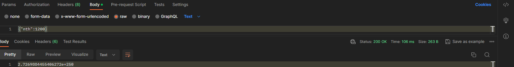
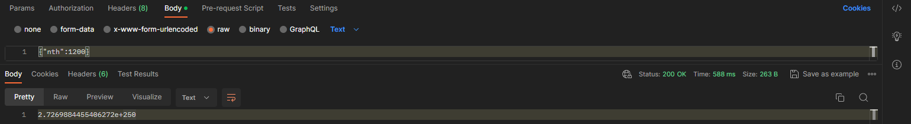
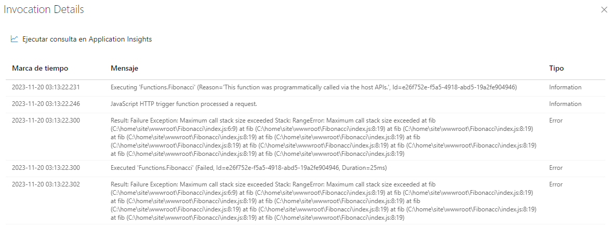
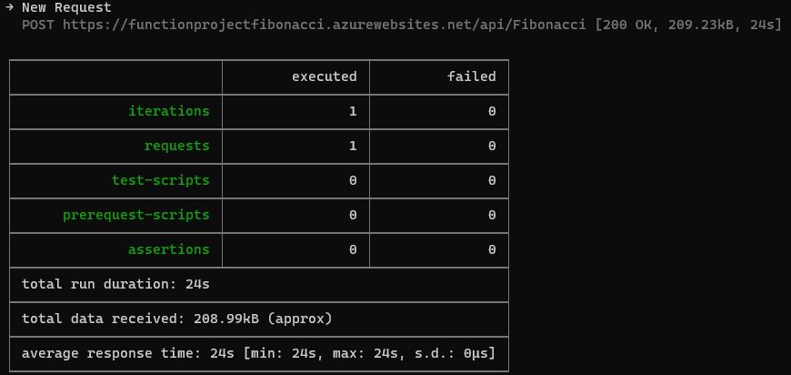
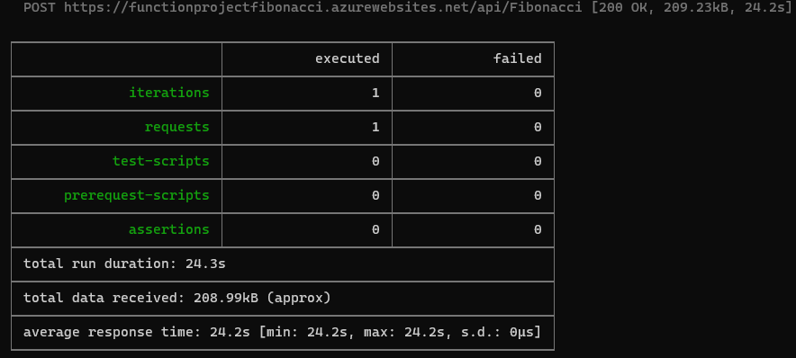
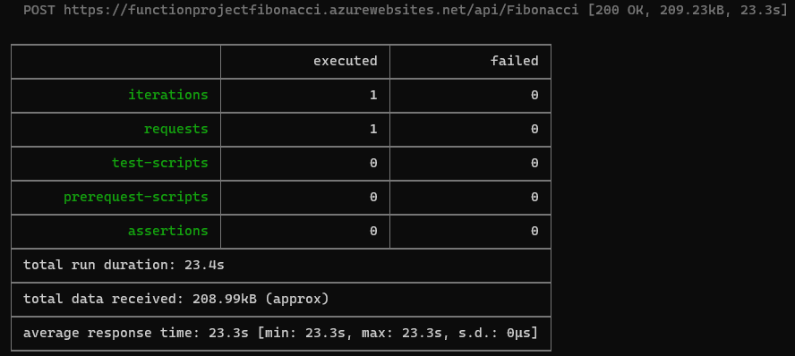
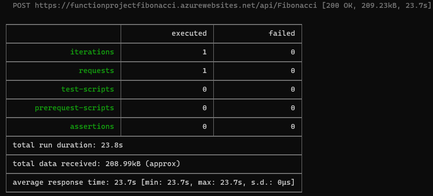
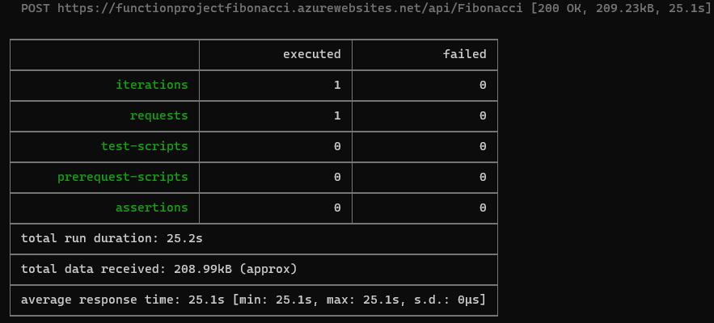
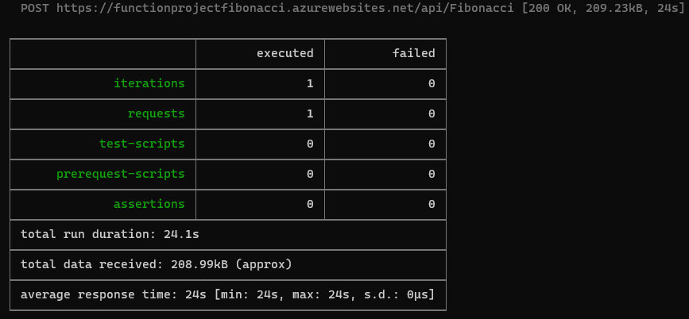

### Escuela Colombiana de Ingeniería
### Arquitecturas de Software - ARSW

## Escalamiento en Azure con Maquinas Virtuales, Sacale Sets y Service Plans

### Dependencias
* Cree una cuenta gratuita dentro de Azure. Para hacerlo puede guiarse de esta [documentación](https://azure.microsoft.com/es-es/free/students/). Al hacerlo usted contará con $100 USD para gastar durante 12 meses.
Antes de iniciar con el laboratorio, revise la siguiente documentación sobre las [Azure Functions](https://www.c-sharpcorner.com/article/an-overview-of-azure-functions/)

### Parte 0 - Entendiendo el escenario de calidad

Adjunto a este laboratorio usted podrá encontrar una aplicación totalmente desarrollada que tiene como objetivo calcular el enésimo valor de la secuencia de Fibonnaci.

**Escalabilidad**
Cuando un conjunto de usuarios consulta un enésimo número (superior a 1000000) de la secuencia de Fibonacci de forma concurrente y el sistema se encuentra bajo condiciones normales de operación, todas las peticiones deben ser respondidas y el consumo de CPU del sistema no puede superar el 70%.

### Escalabilidad Serverless (Functions)

1. Cree una Function App tal cual como se muestra en las  imagenes.


2. Instale la extensión de **Azure Functions** para Visual Studio Code.


3. Despliegue la Function de Fibonacci a Azure usando Visual Studio Code. La primera vez que lo haga se le va a pedir autenticarse, siga las instrucciones.


4. Dirijase al portal de Azure y pruebe la function.


5. Modifique la coleción de POSTMAN con NEWMAN de tal forma que pueda enviar 10 peticiones concurrentes. Verifique los resultados y presente un informe.

El informe se encuentra en el último punto de las preguntas.

6. Cree una nueva Function que resuleva el problema de Fibonacci pero esta vez utilice un enfoque recursivo con memoization. Pruebe la función varias veces, después no haga nada por al menos 5 minutos. Pruebe la función de nuevo con los valores anteriores. ¿Cuál es el comportamiento?.

Para resolver el problema de Fibonacci utilizando un enfoque recursivo con memoization se utilizó el siguiente código:

``` javascript
const memo= {};
module.exports = async function (context, req) {
    context.log('JavaScript HTTP trigger function processed a request.');
    let nth = req.body.nth;
    const fib = (n) => {
        if (n in memo) return memo[n];
        if (n <= 2) return 1;
        memo[n] = fib(n-1) + fib(n-2);
        return memo[n];
    };
    const answer = fib(nth);
    context.res = {
        body: answer.toString()
    };
}
```

Primero se probó la función varias veces, llegando a tener un tiempo de **106 ms** para el Fibonacci de 1200.



Después de esperar 5 minutos se volvió a calcular el Fibonacci de 1200, pero esta vez el tiempo de respuesta de la petición fue de **588 ms**.



Se observó que después de los 5 minutos sin probar/ejecutar la función el tiempo de respuesta aumentaba, esto se debe a que  el sistema de caché tiene un límite de tiempo de expiración. Por defecto, este límite de tiempo es de 5 minutos. Esto significa que si la función no se utiliza durante más de 5 minutos, sus resultados que se habían guardado se eliminarán del sistema de caché.

**Preguntas**

* ¿Qué es un Azure Function?

    Un Azure Function es un servicio de computación sin servidor que permite ejecutar código activado por eventos sin tener que aprovisionar o administrar explícitamente la infraestructura. En otras palabras, es una plataforma informática que permite a los desarrolladores ejecutar código en la nube sin tener que preocuparse por el mantenimiento de los servidores o la infraestructura subyacente.
    
    Las funciones de Azure se pueden implementar en varios lenguajes de programación, incluidos JavaScript, C#, Python, Java, PowerShell y PHP. También se pueden ejecutar en una variedad de eventos, como HTTP, eventos de base de datos, eventos de IoT y colas de mensajes.

* ¿Qué es serverless?

    Serverless es un modelo de ejecución de computación en la nube en el que el proveedor de servicios en la nube se encarga de ejecutar el código, administrar los recursos y escalar la aplicación de forma automática, según la demanda. Esto significa que los desarrolladores no tienen que preocuparse por aprovisionar ni administrar servidores, ni por ajustar la capacidad de la aplicación.

    En serverless, el código se ejecuta en contenedores sin estado que se crean y eliminan de forma dinámica. Estos contenedores se activan por eventos, como solicitudes HTTP, eventos de base de datos o eventos de colas.

* ¿Qué es el runtime y que implica seleccionarlo al momento de crear el Function App?

    El runtime es el conjunto de código e infraestructura que permite que una aplicación de funciones se ejecute en Azure. Se relaciona principalmente con la versión del lenguaje de la función a ejecutar.

    Al seleccionar el runtime al momento de crear el Function App, se están definiendo las siguientes características:

    - Lenguaje de programación: El runtime determina el lenguaje de programación que se puede usar para escribir las funciones de la aplicación.
    - Versiones de lenguaje: El runtime proporciona soporte para varias versiones del lenguaje seleccionado.
    - Características del lenguaje: El runtime proporciona acceso a las características del lenguaje, como bibliotecas y marcos.
    - Rendimiento: El runtime puede afectar el rendimiento de las funciones.

* ¿Por qué es necesario crear un Storage Account de la mano de un Function App?

    Es necesario crear un Storage Account de la mano de un Function App porque las Function App usan Azure Storage para las operaciones de almacenamiento y administración, como la gestión de los desencadenadores y el registro de las funciones.

* ¿Cuáles son los tipos de planes para un Function App?, ¿En qué se diferencias?, mencione ventajas y desventajas de cada uno de ellos.

    Azure Functions ofrece tres tipos de planes de hospedaje:
    - Plan de consumo: Es el plan predeterminado. Ofrece escalabilidad automática y facturación basada en el uso. Las instancias del host de Functions se agregan y quitan de forma dinámica según el número de eventos de entrada.
      - Ventajas:
        Es el plan predeterminado, por lo que es fácil de empezar.
        Ofrece escalabilidad automática, por lo que no tiene que preocuparse por la administración de recursos.
        Solo paga por el tiempo que haya empleado en la ejecución del código.
      - Desventajas:
        Los recursos de proceso son limitados.
        El tiempo máximo de ejecución es de 5 minutos.
    - Plan Premium: Ofrece escalabilidad automática, memoria y CPU más potentes, y un mayor número de instancias. Se factura por el número de segundos de core y la memoria usada en las distintas instancias.
      - Ventajas:
        Ofrece escalabilidad automática, memoria y CPU más potentes, y un mayor número de instancias.
        Permite ejecutar código durante más tiempo del máximo permitido en el plan de consumo.
        Ofrece características que no están disponibles en el plan de consumo, como la conectividad con red virtual.
      - Desventajas:
        Es más caro que el plan de consumo.
    - Plan dedicado: Ofrece escalabilidad manual, memoria y CPU aún más potentes, y un mayor número de instancias. Se factura a los precios de App Service normales.
      - Ventajas:
        Ofrece escalabilidad manual, memoria y CPU aún más potentes, y un mayor número de instancias.
        Permite ejecutar código durante más tiempo del máximo permitido en el plan de consumo.
        Ofrece características que no están disponibles en los otros dos planes, como el soporte para imágenes personalizadas.
      - Desventajas:
        Es el plan más caro.
* ¿Por qué la memoization falla o no funciona de forma correcta?

    No funciona correctamente debido a que al intentar hacer el cálculo con números mayores a 15697 el límite de recursión se excede. 

    

* ¿Cómo funciona el sistema de facturación de las Function App?

    El sistema de facturación de las Function App de Azure se basa en dos componentes:

    - Ejecuciones: Se cuenta cada vez que se ejecuta una función en respuesta a un evento, desencadenado por un enlace. El primer millón de ejecuciones es gratis cada mes.
    - Consumo de recursos: Se calcula multiplicando el tamaño medio de memoria en GB por el tiempo en milisegundos que dura la ejecución de la función. Los precios de Functions incluyen una concesión gratuita al mes de 400.000 GB-segundos.

* Informe

    Para llevar a cabo el 5 punto se usó la siguiente colección postman, la cual envía una solicitud HTTP POST a la URL https://functionprojectfibonacci.azurewebsites.net/api/Fibonacci con un cuerpo {"nth":1000000}, que representa el número al cual se quiere calcular el número su Fibonacci.
```json
{
  "info": {
    "_postman_id": "d43e1889-914b-4060-ac8b-eab8a2dfd373",
    "name": "New Collection",
    "schema": "https://schema.getpostman.com/json/collection/v2.1.0/collection.json",
    "_exporter_id": "31257405"
  },
  "item": [
    {
      "name": "New Request",
      "request": {
        "method": "POST",
        "header": [],
        "body": {
          "mode": "raw",
          "raw": "{\"nth\":1000000}"
        },
        "url": {
          "raw": "https://functionprojectfibonacci.azurewebsites.net/api/Fibonacci",
          "protocol": "https",
          "host": [
            "functionprojectfibonacci",
            "azurewebsites",
            "net"
          ],
          "path": [
            "api",
            "Fibonacci"
          ]
        }
      },
      "response": []
    }
  ]
}
```
y se usó el siguiente comando para ejecutar diez veces concurrentemente la anterior colección de Postman.

```
newman run lab10.json & newman run lab10.json & newman run lab10.json & newman run lab10.json & newman run lab10.json & newman run lab10.json & newman run lab10.json & newman run lab10.json & newman run lab10.json & newman run lab10.json
```
Esto dio los siguientes resultados:












De estos se obtuvo que el promedio total de respuesta a las peticiones fue de **24.34 s**, la petición que más tardó su tiempo fue de **27.6 s** y la que tuvo menor tiempo de respuesta duró **23.3 s**. Además, todas fueron respondidas con éxito, ninguna de estas falló.